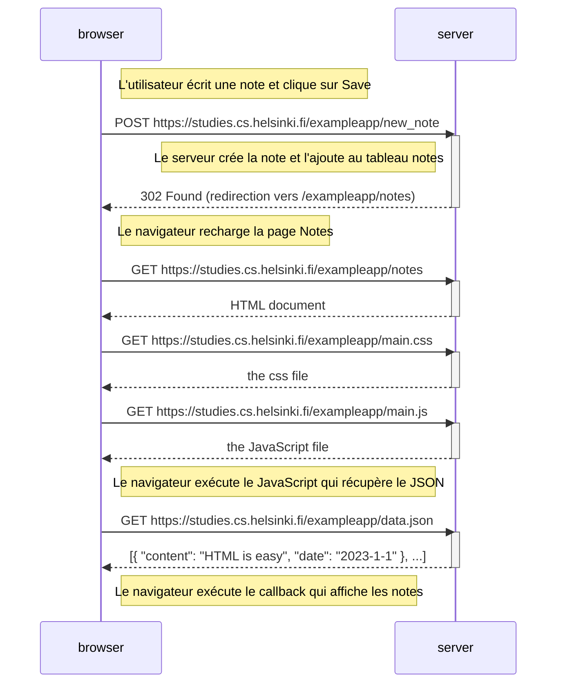
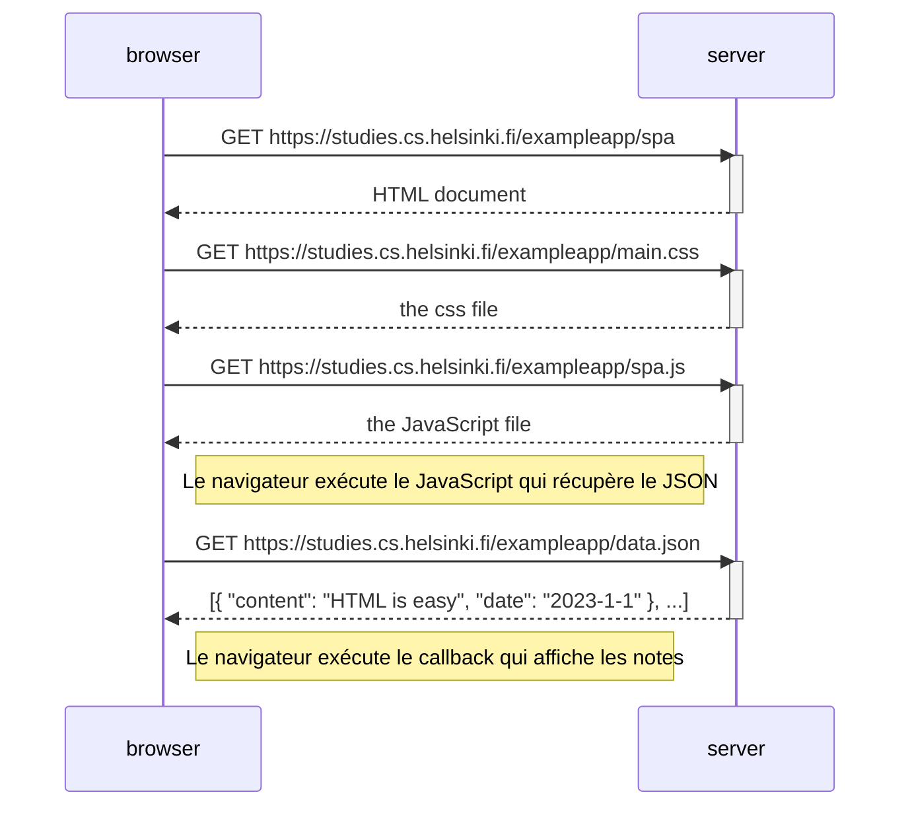
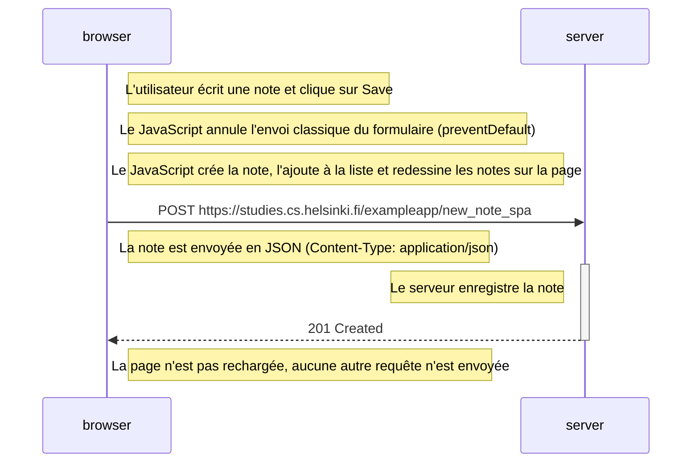

   # Partie 0
## Exercice 0.4

```mermaid
sequenceDiagram
    participant browser
    participant server

    Note right of browser: L'utilisateur écrit une note et clique sur Save

    browser->>server: POST https://studies.cs.helsinki.fi/exampleapp/new_note
    activate server
    Note left of server: Le serveur crée la note et l'ajoute au tableau notes
    server-->>browser: 302 Found (redirection vers /exampleapp/notes)
    deactivate server

    Note right of browser: Le navigateur recharge la page Notes

    browser->>server: GET https://studies.cs.helsinki.fi/exampleapp/notes
    activate server
    server-->>browser: HTML document
    deactivate server

    browser->>server: GET https://studies.cs.helsinki.fi/exampleapp/main.css
    activate server
    server-->>browser: the css file
    deactivate server

    browser->>server: GET https://studies.cs.helsinki.fi/exampleapp/main.js
    activate server
    server-->>browser: the JavaScript file
    deactivate server

    Note right of browser: Le navigateur exécute le JavaScript qui récupère le JSON

    browser->>server: GET https://studies.cs.helsinki.fi/exampleapp/data.json
    activate server
    server-->>browser: [{ "content": "HTML is easy", "date": "2023-1-1" }, ...]
    deactivate server

    Note right of browser: Le navigateur exécute le callback qui affiche les notes
```
## Exercice 0.5

```mermaid
sequenceDiagram
    participant browser
    participant server

    browser->>server: GET https://studies.cs.helsinki.fi/exampleapp/spa
    activate server
    server-->>browser: HTML document
    deactivate server

    browser->>server: GET https://studies.cs.helsinki.fi/exampleapp/main.css
    activate server
    server-->>browser: the css file
    deactivate server

    browser->>server: GET https://studies.cs.helsinki.fi/exampleapp/spa.js
    activate server
    server-->>browser: the JavaScript file
    deactivate server

    Note right of browser: Le navigateur exécute le JavaScript qui récupère le JSON

    browser->>server: GET https://studies.cs.helsinki.fi/exampleapp/data.json
    activate server
    server-->>browser: [{ "content": "HTML is easy", "date": "2023-1-1" }, ...]
    deactivate server

    Note right of browser: Le navigateur exécute le callback qui affiche les notes
```
## Exercice 0.6

```mermaid
sequenceDiagram
    participant browser
    participant server

    Note right of browser: L'utilisateur écrit une note et clique sur Save

    Note right of browser: Le JavaScript annule l'envoi classique du formulaire (preventDefault)
    Note right of browser: Le JavaScript crée la note, l'ajoute à la liste et redessine les notes sur la page

    browser->>server: POST https://studies.cs.helsinki.fi/exampleapp/new_note_spa
    Note right of browser: La note est envoyée en JSON (Content-Type: application/json)
    activate server
    Note left of server: Le serveur enregistre la note
    server-->>browser: 201 Created
    deactivate server

    Note right of browser: La page n'est pas rechargée, aucune autre requête n'est envoyée
```
